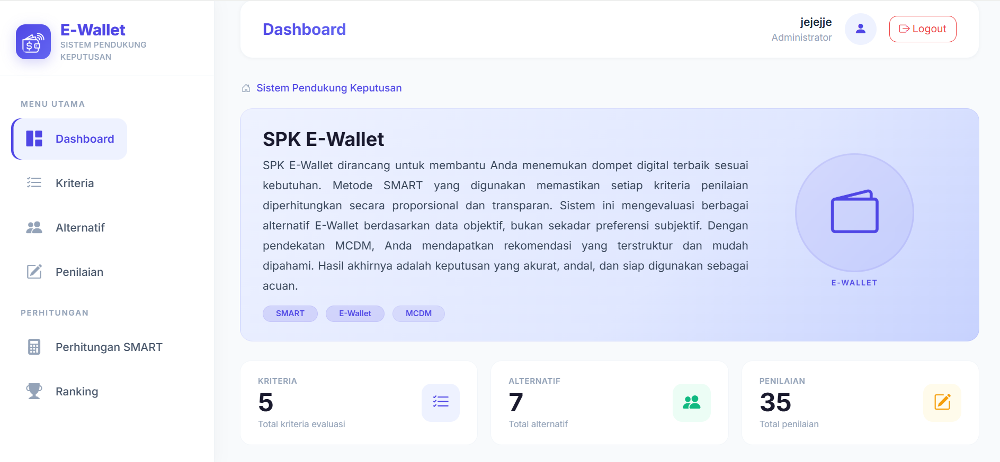
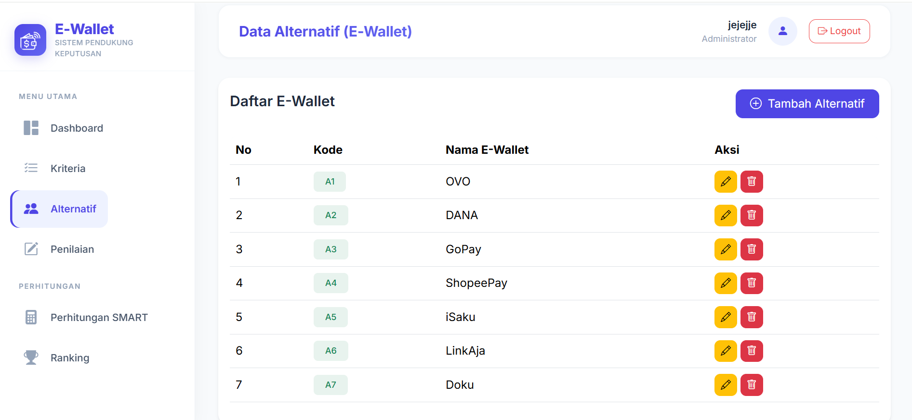
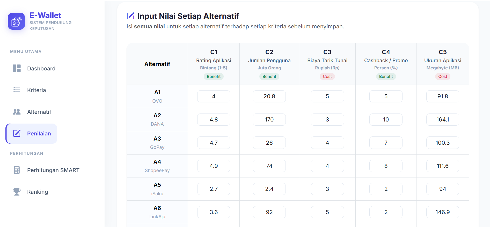
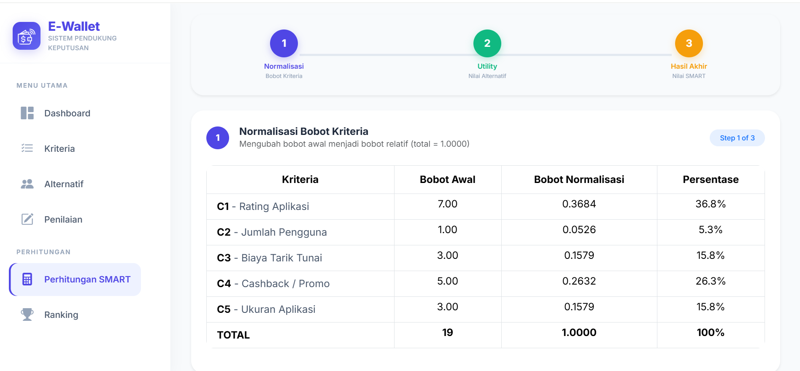
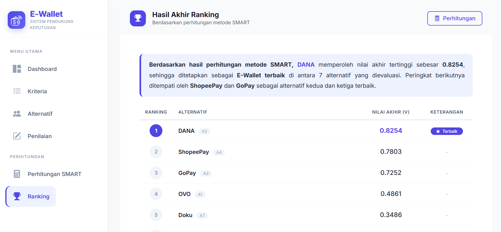

# 🏆 Sistem Pendukung Keputusan Pemilihan E-Wallet Terbaik (Metode SMART)


Sistem Pendukung Keputusan (SPK) berbasis web untuk menentukan **E-Wallet terbaik di Indonesia** menggunakan metode **SMART (Simple Multi-Attribute Rating Technique)**.

---

## 📋 Daftar Isi

- [Tentang Proyek](#-tentang-proyek)
- [Fitur Utama](#-fitur-utama)
- [Tech Stack](#-tech-stack)
- [Struktur Proyek](#-struktur-proyek)
- [Database & ERD](#-database--erd)
- [API Endpoint](#-api-endpoint)
- [Implementasi Metode SMART](#-implementasi-metode-smart)
- [Screenshot](#-screenshot)
- [Cara Instalasi & Menjalankan](#-cara-instalasi--menjalankan)
- [Cara Menggunakan](#-cara-menggunakan)
- [Hasil UAT](#-hasil-uat)
- [Kontributor](#-kontributor)
- [Lisensi](#-lisensi)

---

## 🚀 Tentang Proyek

Proyek ini bertujuan untuk membantu pengguna memilih aplikasi dompet digital (e-wallet) terbaik secara objektif berdasarkan **5 kriteria** utama:

| Kode | Kriteria | Tipe | Bobot |
|------|----------|------|-------|
| C1 | Rating Aplikasi | Benefit | 7 |
| C2 | Jumlah Pengguna | Benefit | 1 |
| C3 | Biaya Tarik Tunai di Indomaret | Cost | 3 |
| C4 | Cashback / Promo | Benefit | 5 |
| C5 | Ukuran Aplikasi | Cost | 3 |

Metode **SMART** dipilih karena sederhana, transparan, dan mudah diaudit. Aplikasi ini telah divalidasi melalui **User Acceptance Testing (UAT)** dengan skor kepuasan **4,28/5 (85,5%)**.

### 🔗 Link Penting
- **Demo Aplikasi**: [https://spkewallet.yaelahver.dev](https://spkewallet.yaelahver.dev)
- **Repository GitHub**: [https://github.com/jesicha10/Sistem-Pendukung-Keputusan-E-Wallet](https://github.com/jesicha10/Sistem-Pendukung-Keputusan-E-Wallet)

---

## ✨ Fitur Utama

| Fitur | Deskripsi |
|-------|-----------|
| **Dashboard** | Menampilkan statistik jumlah kriteria, alternatif, penilaian, dan grafik hasil perhitungan SMART |
| **CRUD Kriteria** | Tambah, edit, hapus data kriteria (kode, nama, bobot, tipe benefit/cost) |
| **CRUD Alternatif** | Tambah, edit, hapus data E-Wallet (kode, nama, upload logo) |
| **Input Penilaian** | Matriks input nilai setiap alternatif terhadap seluruh kriteria (0-100) |
| **Perhitungan SMART** | Menampilkan normalisasi bobot, normalisasi nilai, utility, dan nilai akhir |
| **Ranking** | Menampilkan peringkat E-Wallet dengan badge juara (🏆, 🥈, 🥉) |
| **Export PDF** | Mengekspor hasil ranking ke file PDF |
| **Responsif** | Tampilan optimal di desktop, tablet, dan mobile |

---

## 🛠️ Tech Stack

### A. Backend (Laravel Ecosystem)

| Komponen | Teknologi | Versi | Fungsi |
|----------|-----------|-------|--------|
| Framework | **Laravel** | 12.62.0 | Framework PHP utama dengan arsitektur MVC |
| Bahasa Pemrograman | PHP | 8.2.12 | Bahasa utama untuk logika bisnis |
| Database | SQLite | 3.x | Database ringan untuk penyimpanan data |
| ORM | **Eloquent** | - | ORM bawaan Laravel untuk interaksi database |
| Database Migration | **Laravel Migration** | - | Membuat dan mengelola struktur tabel database |
| PDF Generator | **laravel-dompdf** | - | Generate PDF dari view Blade |
| Asset Management | **Vite** | - | Build tool bawaan Laravel untuk mengelola CSS/JS |
| Routing | **Laravel Routing** | - | Mendefinisikan endpoint URL dan menghubungkan ke Controller |

### B. Frontend (Terintegrasi dengan Laravel)

| Komponen | Teknologi | Versi | Fungsi |
|----------|-----------|-------|--------|
| CSS Framework | Bootstrap | 5.3.3 | Framework CSS untuk tampilan responsif dan modern |
| Icons | Bootstrap Icons | 1.11.3 | Library ikon vektor |
| Chart | Chart.js | 4.4.4 | Visualisasi data dalam bentuk grafik |
| Alert | SweetAlert2 | 11.10.8 | Popup modern untuk notifikasi dan konfirmasi |
| Table | DataTables | 1.13.8 | Tabel interaktif dengan sorting, searching, dan pagination |
| Font | Google Fonts (Poppins) | - | Font modern untuk UI |

### C. Environment & Tools

| Komponen | Teknologi | Fungsi |
|----------|-----------|--------|
| Server | PHP Artisan (`php artisan serve`) | Server lokal untuk development Laravel |
| Package Manager PHP | Composer | Manajemen dependency Laravel dan PHP packages |
| Package Manager JS | NPM / Node.js | Manajemen dependency frontend |
| Version Control | Git & GitHub | Manajemen kode dan kolaborasi |
| IDE | Visual Studio Code | Text editor untuk pengembangan |

---

## 📁 Struktur Proyek

```
Sistem-Pendukung-Keputusan-E-Wallet/
├── app/
│   ├── Http/
│   │   └── Controllers/
│   │       ├── DashboardController.php      # Statistik dashboard
│   │       ├── KriteriaController.php       # CRUD kriteria
│   │       ├── AlternatifController.php     # CRUD alternatif
│   │       ├── PenilaianController.php      # Input penilaian
│   │       ├── SmartController.php          # Perhitungan SMART
│   │       └── RankingController.php        # Ranking & PDF
│   └── Models/
│       ├── Kriteria.php                     # Model kriteria
│       ├── Alternatif.php                   # Model alternatif
│       └── Penilaian.php                    # Model penilaian
├── database/
│   └── migrations/
│       ├── create_kriteria_table.php
│       ├── create_alternatif_table.php
│       └── create_penilaian_table.php
├── resources/
│   └── views/
│       ├── layouts/
│       │   └── app.blade.php                # Layout utama
│       ├── dashboard/
│       │   └── index.blade.php              # Halaman dashboard
│       ├── kriteria/
│       │   ├── index.blade.php              # Daftar kriteria
│       │   ├── create.blade.php             # Form tambah kriteria
│       │   └── edit.blade.php               # Form edit kriteria
│       ├── alternatif/
│       │   ├── index.blade.php              # Daftar alternatif
│       │   ├── create.blade.php             # Form tambah alternatif
│       │   └── edit.blade.php               # Form edit alternatif
│       ├── penilaian/
│       │   └── index.blade.php              # Matriks input penilaian
│       ├── smart/
│       │   └── index.blade.php              # Hasil perhitungan SMART
│       └── ranking/
│           ├── index.blade.php              # Ranking E-Wallet
│           └── pdf.blade.php                # Template export PDF
├── routes/
│   └── web.php                               # Semua route
├── public/
│   └── uploads/
│       └── logos/                            # Folder logo E-Wallet
├── composer.json
├── package.json
└── README.md
```

---

## 🗄️ Database & ERD

### Entity Relationship Diagram (ERD)

```
┌─────────────────────────────────────────────────────────────────────────────┐
│                            ERD SPK E-WALLET                               │
├─────────────────────────────────────────────────────────────────────────────┤
│                                                                             │
│  ┌─────────────┐          ┌─────────────┐          ┌─────────────┐        │
│  │  KRITERIA   │          │  PENILAIAN  │          │  ALTERNATIF │        │
│  ├─────────────┤          ├─────────────┤          ├─────────────┤        │
│  │ id          │──┐       │ id          │       ┌──│ id          │        │
│  │ kode_kriteria│  └──────>│ kriteria_id │       │  │ kode_alt   │        │
│  │ nama_kriteria│          │ alternatif_id│──────┘  │ nama_ewallet│        │
│  │ bobot       │          │ nilai       │          │ logo        │        │
│  │ tipe        │          │ created_at  │          │ created_at  │        │
│  │ created_at  │          │ updated_at  │          │ updated_at  │        │
│  │ updated_at  │          └─────────────┘          └─────────────┘        │
│  └─────────────┘               |                         |                │
│       1                        |                         |                │
│       |                        |                         |                │
│       └────── hasMany ────────┘                         |                │
│                               └────── belongsTo ────────┘                │
│                                                                             │
│  Relasi:                                                                   │
│  • KRITERIA (1) → PENILAIAN (*)  : Satu kriteria memiliki banyak penilaian │
│  • ALTERNATIF (1) → PENILAIAN (*) : Satu alternatif memiliki banyak penilaian│
│  • PENILAIAN (*) → KRITERIA (1)   : Setiap penilaian milik satu kriteria   │
│  • PENILAIAN (*) → ALTERNATIF (1) : Setiap penilaian milik satu alternatif │
└─────────────────────────────────────────────────────────────────────────────┘
```

### Struktur Tabel

#### Tabel `kriteria`

| Field | Tipe Data | Nullable | Keterangan |
|-------|-----------|----------|------------|
| `id` | BIGINT UNSIGNED | No | Primary Key, auto increment |
| `kode_kriteria` | VARCHAR(10) | No | Kode unik (C1, C2, C3, ...) |
| `nama_kriteria` | VARCHAR(100) | No | Nama kriteria |
| `bobot` | DECIMAL(5,2) | No | Bobot dalam persen (0-100) |
| `tipe` | ENUM('benefit','cost') | No | Benefit / Cost |
| `created_at` | TIMESTAMP | Yes | Waktu dibuat |
| `updated_at` | TIMESTAMP | Yes | Waktu diupdate |

#### Tabel `alternatif`

| Field | Tipe Data | Nullable | Keterangan |
|-------|-----------|----------|------------|
| `id` | BIGINT UNSIGNED | No | Primary Key, auto increment |
| `kode_alternatif` | VARCHAR(10) | No | Kode unik (A1, A2, A3, ...) |
| `nama_ewallet` | VARCHAR(100) | No | Nama E-Wallet |
| `logo` | VARCHAR(255) | Yes | Path file logo (nullable) |
| `created_at` | TIMESTAMP | Yes | Waktu dibuat |
| `updated_at` | TIMESTAMP | Yes | Waktu diupdate |

#### Tabel `penilaian`

| Field | Tipe Data | Nullable | Keterangan |
|-------|-----------|----------|------------|
| `id` | BIGINT UNSIGNED | No | Primary Key, auto increment |
| `alternatif_id` | BIGINT UNSIGNED | No | Foreign Key ke `alternatif.id` |
| `kriteria_id` | BIGINT UNSIGNED | No | Foreign Key ke `kriteria.id` |
| `nilai` | DECIMAL(5,2) | No | Nilai penilaian (0-100) |
| `created_at` | TIMESTAMP | Yes | Waktu dibuat |
| `updated_at` | TIMESTAMP | Yes | Waktu diupdate |

### Relasi (Eloquent ORM)

```php
// app/Models/Kriteria.php
public function penilaian()
{
    return $this->hasMany(Penilaian::class, 'kriteria_id');
}

// app/Models/Alternatif.php
public function penilaian()
{
    return $this->hasMany(Penilaian::class, 'alternatif_id');
}

// app/Models/Penilaian.php
public function alternatif()
{
    return $this->belongsTo(Alternatif::class, 'alternatif_id');
}

public function kriteria()
{
    return $this->belongsTo(Kriteria::class, 'kriteria_id');
}
```

---

## 🔗 API Endpoint

Sistem ini menggunakan **Laravel Routing** untuk mendefinisikan semua endpoint. Berikut adalah daftar route yang terdaftar di `routes/web.php`:

```php
// routes/web.php
Route::get('/', function () {
    return redirect()->route('dashboard');
});

// Dashboard
Route::get('/dashboard', [DashboardController::class, 'index'])->name('dashboard');

// Resource CRUD Kriteria
Route::resource('kriteria', KriteriaController::class);

// Resource CRUD Alternatif
Route::resource('alternatif', AlternatifController::class);

// Penilaian
Route::get('/penilaian', [PenilaianController::class, 'index'])->name('penilaian.index');
Route::post('/penilaian', [PenilaianController::class, 'store'])->name('penilaian.store');

// Perhitungan SMART & Ranking
Route::get('/smart', [SmartController::class, 'index'])->name('smart.index');
Route::get('/ranking', [RankingController::class, 'index'])->name('ranking.index');
Route::get('/ranking/export-pdf', [RankingController::class, 'exportPdf'])->name('ranking.export-pdf');
```

### Tabel Endpoint Lengkap

| Method | Endpoint | Controller & Method | Deskripsi |
|--------|----------|---------------------|-----------|
| GET | `/` | - | Redirect ke dashboard |
| GET | `/dashboard` | DashboardController@index | Menampilkan halaman dashboard |
| GET | `/kriteria` | KriteriaController@index | Menampilkan daftar kriteria |
| GET | `/kriteria/create` | KriteriaController@create | Form tambah kriteria |
| POST | `/kriteria` | KriteriaController@store | Menyimpan kriteria baru |
| GET | `/kriteria/{id}/edit` | KriteriaController@edit | Form edit kriteria |
| PUT | `/kriteria/{id}` | KriteriaController@update | Update kriteria |
| DELETE | `/kriteria/{id}` | KriteriaController@destroy | Hapus kriteria |
| GET | `/alternatif` | AlternatifController@index | Menampilkan daftar alternatif |
| GET | `/alternatif/create` | AlternatifController@create | Form tambah alternatif |
| POST | `/alternatif` | AlternatifController@store | Menyimpan alternatif baru |
| GET | `/alternatif/{id}/edit` | AlternatifController@edit | Form edit alternatif |
| PUT | `/alternatif/{id}` | AlternatifController@update | Update alternatif |
| DELETE | `/alternatif/{id}` | AlternatifController@destroy | Hapus alternatif |
| GET | `/penilaian` | PenilaianController@index | Menampilkan matriks penilaian |
| POST | `/penilaian` | PenilaianController@store | Menyimpan semua penilaian |
| GET | `/smart` | SmartController@index | Menampilkan hasil perhitungan SMART |
| GET | `/ranking` | RankingController@index | Menampilkan ranking E-Wallet |
| GET | `/ranking/export-pdf` | RankingController@exportPdf | Ekspor ranking ke PDF |

---

## 🧮 Implementasi Metode SMART

### Rumus yang Digunakan

**1. Normalisasi Bobot:**
```
Wn(i) = W(i) / ΣW
```
Keterangan:
- Wn(i) = Bobot normalisasi kriteria ke-i
- W(i) = Bobot awal kriteria ke-i
- ΣW = Total bobot seluruh kriteria

**2. Normalisasi Nilai (Min-Max):**

Untuk **Benefit** (semakin tinggi semakin baik):
```
N(i,j) = (X(i,j) - Min(j)) / (Max(j) - Min(j))
```

Untuk **Cost** (semakin rendah semakin baik):
```
N(i,j) = (Max(j) - X(i,j)) / (Max(j) - Min(j))
```

Keterangan:
- N(i,j) = Nilai normalisasi alternatif i terhadap kriteria j
- X(i,j) = Nilai awal alternatif i terhadap kriteria j
- Min(j) = Nilai minimum kriteria j
- Max(j) = Nilai maksimum kriteria j

**3. Utility Value:**
```
U(i,j) = N(i,j) × Wn(j)
```
Keterangan:
- U(i,j) = Utility alternatif i terhadap kriteria j
- N(i,j) = Nilai normalisasi
- Wn(j) = Bobot normalisasi kriteria j

**4. Nilai Akhir:**
```
SA(i) = Σ U(i,j)
```
Keterangan:
- SA(i) = Nilai akhir alternatif i
- Σ U(i,j) = Jumlah seluruh utility alternatif i

### Source Code Implementasi (SmartController.php)

```php
<?php

namespace App\Http\Controllers;

use App\Models\Kriteria;
use App\Models\Alternatif;
use App\Models\Penilaian;
use Illuminate\Http\Request;

class SmartController extends Controller
{
    public function index()
    {
        // 1. Ambil semua data menggunakan Eloquent ORM
        $kriteria = Kriteria::orderBy('kode_kriteria')->get();
        $alternatif = Alternatif::orderBy('kode_alternatif')->get();

        // Jika tidak ada data, kirim view dengan pesan
        if ($kriteria->isEmpty() || $alternatif->isEmpty()) {
            return view('smart.index', [
                'kriteria' => $kriteria,
                'alternatif' => $alternatif,
                'bobotNormalisasi' => [],
                'hasil' => [],
                'message' => 'Data kriteria atau alternatif belum lengkap.'
            ]);
        }

        // 2. Normalisasi bobot
        $totalBobot = $kriteria->sum('bobot');
        $bobotNormalisasi = [];
        foreach ($kriteria as $k) {
            $bobotNormalisasi[$k->id] = $totalBobot > 0 ? $k->bobot / $totalBobot : 0;
        }

        // 3. Ambil nilai penilaian dari database
        $nilaiMatrix = [];
        foreach ($alternatif as $alt) {
            foreach ($kriteria as $krit) {
                $nilai = Penilaian::where('alternatif_id', $alt->id)
                    ->where('kriteria_id', $krit->id)
                    ->first();
                $nilaiMatrix[$alt->id][$krit->id] = $nilai ? $nilai->nilai : 0;
            }
        }

        // 4. Normalisasi nilai (min-max)
        $normalisasi = [];
        foreach ($kriteria as $krit) {
            $values = [];
            foreach ($alternatif as $alt) {
                $values[] = $nilaiMatrix[$alt->id][$krit->id];
            }
            $min = min($values);
            $max = max($values);

            if ($min == $max) {
                foreach ($alternatif as $alt) {
                    $normalisasi[$alt->id][$krit->id] = 1;
                }
            } else {
                foreach ($alternatif as $alt) {
                    $nilai = $nilaiMatrix[$alt->id][$krit->id];
                    if ($krit->tipe == 'benefit') {
                        $normalisasi[$alt->id][$krit->id] = ($nilai - $min) / ($max - $min);
                    } else { // cost
                        $normalisasi[$alt->id][$krit->id] = ($max - $nilai) / ($max - $min);
                    }
                }
            }
        }

        // 5. Hitung utility & nilai akhir
        $hasil = [];
        foreach ($alternatif as $alt) {
            $total = 0;
            foreach ($kriteria as $krit) {
                $utility = $normalisasi[$alt->id][$krit->id] * $bobotNormalisasi[$krit->id];
                $total += $utility;
                $hasil[$alt->id]['detail'][$krit->id] = [
                    'normalisasi' => $normalisasi[$alt->id][$krit->id],
                    'bobot_normalisasi' => $bobotNormalisasi[$krit->id],
                    'utility' => $utility,
                ];
            }
            $hasil[$alt->id]['nilai_akhir'] = $total;
            $hasil[$alt->id]['alternatif'] = $alt;
        }

        // 6. Urutkan & beri ranking
        usort($hasil, function ($a, $b) {
            return $b['nilai_akhir'] <=> $a['nilai_akhir'];
        });

        $ranking = 1;
        foreach ($hasil as &$item) {
            $item['ranking'] = $ranking++;
        }

        // 7. Kirim data ke view (Blade)
        return view('smart.index', compact('kriteria', 'alternatif', 'hasil', 'bobotNormalisasi'));
    }
}
```

### Export PDF Ranking

Fungsi export PDF diimplementasikan di `RankingController.php` menggunakan library `laravel-dompdf`:

```php
public function exportPdf()
{
    // ... perhitungan sama seperti di atas ...
    
    $pdf = Pdf::loadView('ranking.pdf', compact('kriteria', 'alternatif', 'hasil'));
    return $pdf->download('ranking_ewallet.pdf');
}
```

---

## 📸 Screenshot

> **Catatan:** Untuk melihat screenshot, silakan buka folder `screenshots/` di repository ini.

| Halaman | Screenshot |
|---------|------------|
| Dashboard |  |
| Data Kriteria |  |
| Data Alternatif |  |
| Input Penilaian |  |
| Perhitungan SMART |  |
| Ranking |  |

---

## 🚀 Cara Instalasi & Menjalankan

### Prasyarat
- PHP 8.2+
- Composer
- Node.js & NPM
- SQLite (atau MySQL)

### Langkah-langkah

1. **Clone repository**
```bash
git clone https://github.com/jesicha10/Sistem-Pendukung-Keputusan-E-Wallet.git
cd Sistem-Pendukung-Keputusan-E-Wallet
```

2. **Instal dependency PHP**
```bash
composer install
```

3. **Instal dependency frontend**
```bash
npm install
```

4. **Copy file environment**
```bash
cp .env.example .env
```

5. **Generate key**
```bash
php artisan key:generate
```

6. **Konfigurasi database** (edit `.env`)
```env
DB_CONNECTION=sqlite
# atau MySQL
# DB_CONNECTION=mysql
# DB_HOST=127.0.0.1
# DB_PORT=3306
# DB_DATABASE=spk_ewallet
# DB_USERNAME=root
# DB_PASSWORD=
```

7. **Jalankan migration**
```bash
php artisan migrate
```

8. **Build asset frontend**
```bash
npm run build
```

9. **Jalankan server**
```bash
# Terminal 1: Laravel Server
php artisan serve

# Terminal 2: Vite (development)
npm run dev
```

10. **Buka aplikasi**
```
http://127.0.0.1:8000
```

---

## 📖 Cara Menggunakan

### 1. Tambahkan Data Kriteria
- Buka menu **Kriteria** → Klik **Tambah Kriteria**
- Isi: Kode (C1), Nama, Bobot, Tipe (Benefit/Cost)
- Klik **Simpan**

### 2. Tambahkan Data Alternatif
- Buka menu **Alternatif** → Klik **Tambah Alternatif**
- Isi: Kode (A1), Nama E-Wallet, Upload Logo (opsional)
- Klik **Simpan**

### 3. Input Penilaian
- Buka menu **Penilaian**
- Isi nilai setiap alternatif terhadap setiap kriteria (0-100)
- Klik **Simpan Semua Penilaian**

### 4. Lihat Hasil Perhitungan
- Buka menu **Perhitungan SMART** untuk melihat normalisasi, utility, dan nilai akhir
- Buka menu **Ranking** untuk melihat peringkat akhir

### 5. Export PDF
- Di halaman **Ranking**, klik tombol **Cetak PDF**

---

## 📊 Hasil User Acceptance Testing (UAT)

### Rata-rata Skor (Skala 1-5, N=8 Responden)

| No | Pernyataan | Rata-rata |
|----|------------|-----------|
| 1 | Tampilan website SPK E-Wallet mudah dipahami | 4.25 |
| 2 | Menu navigasi mudah digunakan | 4.12 |
| 3 | Proses login dan registrasi berjalan lancar | 4.50 |
| 4 | Form input data (kriteria, alternatif, penilaian) mudah diisi | 4.12 |
| 5 | Fitur CRUD pada kriteria berjalan dengan baik | 4.38 |
| 6 | Fitur CRUD pada alternatif berjalan dengan baik | 4.38 |
| 7 | Perhitungan metode SMART menghasilkan output yang akurat | 3.88 |
| 8 | Fitur ranking menampilkan peringkat e-wallet dengan benar | 4.38 |
| 9 | Sistem ini membantu pengguna memilih e-wallet terbaik | 4.50 |
| 10 | Perhitungan SMART dan hasil ranking berfungsi dengan baik dan akurat | 4.38 |
| 11 | Kepuasan keseluruhan terhadap sistem | 4.62 |
| 12 | Tampilan website menarik dan profesional | 4.25 |
| 13 | Warna dan font yang digunakan nyaman dilihat | 4.12 |
| 14 | Tata letak informasi terstruktur dengan baik | 4.00 |
| | **Rata-rata Skor Keseluruhan** | **4.28 (85.5%)** |

**Kategori: SANGAT BAIK**

### Interpretasi
Rata-rata skor keseluruhan sebesar 4,28 dari 5 (85,5%) termasuk dalam kategori interpretasi **"Sangat Baik"** pada rentang interpretasi skala Likert standar, menunjukkan bahwa responden menilai sistem ini akurat, mudah digunakan, dan menarik secara visual.

---


---

## 📝 Lisensi

Proyek ini dilisensikan di bawah **MIT License** - lihat file [LICENSE](LICENSE) untuk detail.

---

## 🙏 Ucapan Terima Kasih

- **Ir. Gede Surya Mahendra, S.Pd., M.Kom.** - Dosen Pengampu Mata Kuliah Sistem Pendukung Keputusan
- **Universitas Pendidikan Ganesha** - Tempat penelitian dan pengembangan

---

<div align="center">
  <sub>Built with ❤️ using Laravel & Bootstrap</sub>
</div>

<p align="center"><a href="https://laravel.com" target="_blank"></a></p>

<p align="center">
<a href="https://github.com/laravel/framework/actions"></a>
<a href="https://packagist.org/packages/laravel/framework"></a>
<a href="https://packagist.org/packages/laravel/framework"></a>
<a href="https://packagist.org/packages/laravel/framework"></a>
</p>

## About Laravel

Laravel is a web application framework with expressive, elegant syntax. We believe development must be an enjoyable and creative experience to be truly fulfilling. Laravel takes the pain out of development by easing common tasks used in many web projects, such as:

- [Simple, fast routing engine](https://laravel.com/docs/routing).
- [Powerful dependency injection container](https://laravel.com/docs/container).
- Multiple back-ends for [session](https://laravel.com/docs/session) and [cache](https://laravel.com/docs/cache) storage.
- Expressive, intuitive [database ORM](https://laravel.com/docs/eloquent).
- Database agnostic [schema migrations](https://laravel.com/docs/migrations).
- [Robust background job processing](https://laravel.com/docs/queues).
- [Real-time event broadcasting](https://laravel.com/docs/broadcasting).

Laravel is accessible, powerful, and provides tools required for large, robust applications.

## Learning Laravel

Laravel has the most extensive and thorough [documentation](https://laravel.com/docs) and video tutorial library of all modern web application frameworks, making it a breeze to get started with the framework. You can also check out [Laravel Learn](https://laravel.com/learn), where you will be guided through building a modern Laravel application.

If you don't feel like reading, [Laracasts](https://laracasts.com) can help. Laracasts contains thousands of video tutorials on a range of topics including Laravel, modern PHP, unit testing, and JavaScript. Boost your skills by digging into our comprehensive video library.

## Laravel Sponsors

We would like to extend our thanks to the following sponsors for funding Laravel development. If you are interested in becoming a sponsor, please visit the [Laravel Partners program](https://partners.laravel.com).

### Premium Partners

- **[Vehikl](https://vehikl.com)**
- **[Tighten Co.](https://tighten.co)**
- **[Kirschbaum Development Group](https://kirschbaumdevelopment.com)**
- **[64 Robots](https://64robots.com)**
- **[Curotec](https://www.curotec.com/services/technologies/laravel)**
- **[DevSquad](https://devsquad.com/hire-laravel-developers)**
- **[Redberry](https://redberry.international/laravel-development)**
- **[Active Logic](https://activelogic.com)**

## Contributing

Thank you for considering contributing to the Laravel framework! The contribution guide can be found in the [Laravel documentation](https://laravel.com/docs/contributions).

## Code of Conduct

In order to ensure that the Laravel community is welcoming to all, please review and abide by the [Code of Conduct](https://laravel.com/docs/contributions#code-of-conduct).

## Security Vulnerabilities

If you discover a security vulnerability within Laravel, please send an e-mail to Taylor Otwell via [taylor@laravel.com](mailto:taylor@laravel.com). All security vulnerabilities will be promptly addressed.

## License

The Laravel framework is open-sourced software licensed under the [MIT license](https://opensource.org/licenses/MIT).
